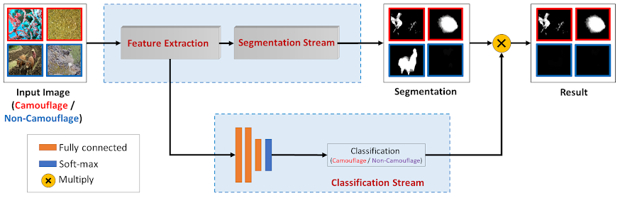

Anabranch Network (ANet) for Camouflaged Object Segmentation
=====================================================================================

Visit our [Project Page](https://sites.google.com/view/ltnghia/research/camo) for accessing the paper, and the pre-computed results.

Citation
--------------

Please cite the following paper: 

    @article{ltnghia-CVIU2019,
        Title          = {Anabranch Network for Camouflaged Object Segmentation},
        Author         = {Trung-Nghia Le and Tam V. Nguyen and Zhongliang Nie and Minh-Triet Tran and Akihiro Sugimoto},
        Journal        = {Journal of Computer Vision and Image Understanding},
        Year           = {2019},
        Volume         = {184}, 
        Pages          = {45-56}, 
}

Contact: [Trung-Nghia Le](https://sites.google.com/view/ltnghia).

